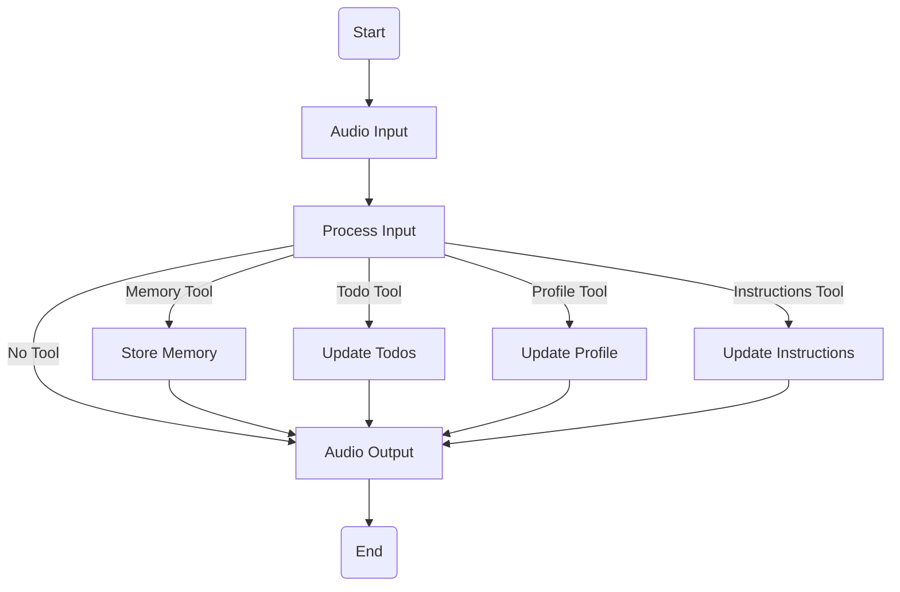

# MaltAI Agent

A voice-controlled AI assistant that can manage tasks, remember information, and adapt to user preferences.

## Graph Architecture



## Features

### Implemented ✅
- Voice input/output interface
  - Speech-to-text using OpenAI Whisper
  - Text-to-speech using ElevenLabs
- Basic memory system
- Tool framework
  - Memory Tool: Store important information
  - Todo Tool: Manage tasks and reminders
  - Profile Tool: Track user information
  - Instructions Tool: Update agent behavior

### In Progress 🚧
- Enhanced memory retrieval system
- Better context management
- Tool improvements:
  - Todo priorities and deadlines
  - Profile preferences and interests
  - Instruction fine-tuning

### Planned 🎯
- Hardware integration capabilities
- Custom skill modules
- API integrations:
  - Weather
  - Calendar
  - Home automation
- Multi-turn conversation improvements
- Voice customization options

## Project Structure

```
maltai/
├── src/
│   └── maltai_agent/
│       ├── __init__.py
│       ├── audio.py        # Voice interface
│       ├── configuration.py # Config management
│       ├── graph.py        # Agent workflow
│       ├── prompts.py      # System prompts
│       ├── state.py        # State management
│       └── tools/          # Agent tools
│           ├── __init__.py
│           ├── memory_tool.py
│           ├── todo_tool.py
│           ├── profile_tool.py
│           └── instructions_tool.py
└── tests/
```

## Setup

1. Install dependencies:
```bash
poetry install
```

2. Set up environment variables:
```bash
cp .env.example .env
# Edit .env with your API keys:
# - OPENAI_API_KEY
# - ELEVENLABS_API_KEY
```

3. Run the agent:
```bash
poetry run python run_agent.py
```

## Development

### Adding New Tools
1. Create a new tool file in `src/maltai_agent/tools/`
2. Define the tool schema using Pydantic
3. Create the tool function
4. Add routing in `graph.py`
5. Update prompts in `prompts.py`

### Testing
```bash
poetry run pytest
```

## Next Steps

1. Enhance Tool Functionality
   - [ ] Add todo priorities
   - [ ] Implement deadlines
   - [ ] Add task categories
   - [ ] Improve profile management

2. Memory System
   - [ ] Better context retrieval
   - [ ] Long-term memory storage
   - [ ] Memory summarization

3. Voice Interface
   - [ ] Multiple voice options
   - [ ] Voice emotion detection
   - [ ] Background noise handling

4. Hardware Integration
   - [ ] GPIO control
   - [ ] Sensor reading
   - [ ] LED feedback
   - [ ] Motor control

