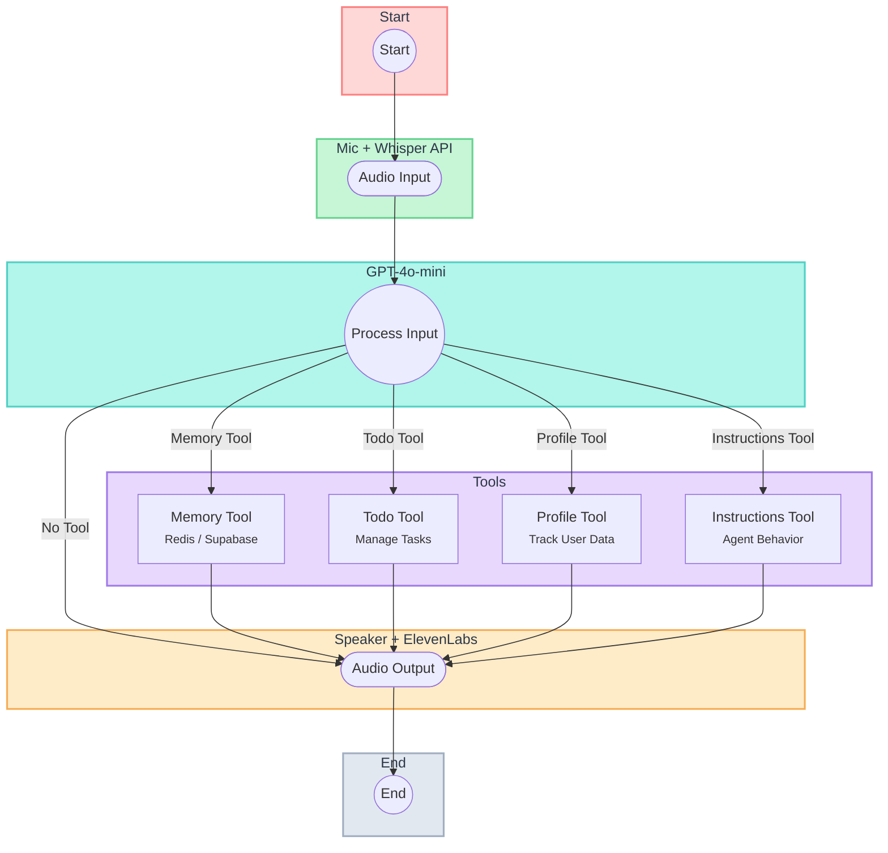
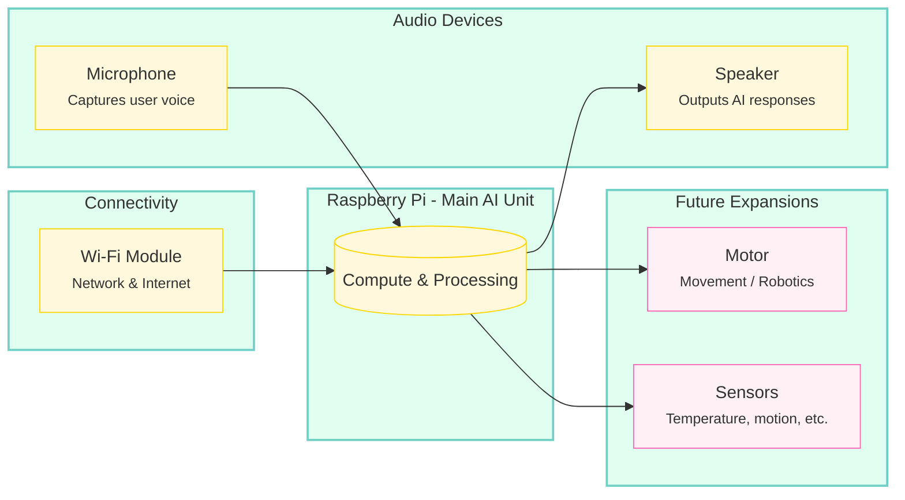

# MaltAI AI Assistant

## Overview

**Goal**: Build a speech-based AI system that can run on a computer or a small device like a Raspberry Pi or ESP32. It listens for user commands, responds with synthesized voice, and can be expanded to control external hardware.

---

## High-Level Architecture

| Layer                 | Components                              | Description                                       |
|-----------------------|-----------------------------------------|---------------------------------------------------|
| **Hardware**          | Raspberry Pi / Arduino, Mic, Speaker    | Physical devices for audio input/output           |
| **Operating System**  | Linux (e.g., Raspbian)                  | Base environment for running the software         |
| **Engine**            | Speech Recognition, Text-to-Speech, NLP | Core AI features (listen, process, speak)         |
| **Command Loop**      | Orchestration Engine                    | Routes commands, manages workflow                 |
| **Tools**             | Memory, Todo, Profile, Instructions     | Modules that handle specific tasks and data       |
| **UI & APIs**         | Web Interface (Flask), External APIs     | User interaction and integrations (weather, etc.) |

---

## Features

### Engine
- **Speech Recognition**: Converts user speech to text (e.g., Google Speech-to-Text, CMU Sphinx, or Whisper).  
- **Text-to-Speech (TTS)**: Replies in a synthesized voice (e.g., Google TTS or ElevenLabs).  
- **Natural Language Processing (NLP)**: Understands user commands (e.g., GPT-based).

### Current Command Loop


- **Audio Input** via microphone + Whisper API  
- **Processing** with GPT-4 mini  
- **Memory** using Redis/Supabase  
- **Audio Output** via speaker + ElevenLabs  



- **Main Orchestration**: Directs speech inputs to the correct tool or process.  
- **State Management**: Tracks current context, memory references, and flow control.  
- **Task Execution**: Coordinates tasks based on recognized commands (like fetching info or updating to-dos).

### Tools Overview

| **Tool**                | **Description**                                                                                                   | **Status**      |
|-------------------------|-------------------------------------------------------------------------------------------------------------------|-----------------|
| **Memory Tool**         | Stores and retrieves important information. Uses short-term or long-term storage for context (e.g., Redis/Supabase). | **Implemented & Tested** |
| **Todo Tool**           | Manages tasks, reminders, and deadlines. Helps organize daily or scheduled actions.                               | **Implemented & Tested** |
| **Profile Tool**        | Maintains user data (preferences, history) and personalizes interactions.                                         | **Implemented & Tested** |
| **Instructions Tool**   | Updates agent behavior in real time. Adjusts system prompts or conversation style.                                | **Implemented & Tested** |
| **Email Tool**          | Connects to email accounts, handles sending/reading, and attachment management.                                   | **Planned**     |
| **PDF Parsing Tool**    | Extracts text, summarizes or searches PDFs, and integrates parsed data into memory.                               | **Planned**     |
| **Weather/Calendar Tool** | Fetches local weather data or scheduled events. Potential for scheduling tasks or sending reminders.             | **Planned**     |


---


## Setup

1. Install dependencies:
```bash
poetry install
```

2. Set up environment variables:
```bash
cp .env.example .env
# Edit .env with your API keys:
# - OPENAI_API_KEY
# - ELEVENLABS_API_KEY
```

3. Run the agent:
```bash
poetry run python run_agent.py
```

## Development

### Software
- **Core Agent Logic**  
  - [x] Voice input (Speech-to-text)  
  - [x] Voice output (Text-to-speech)  
  - [x] Initial command loop and orchestration  
  - [ ] Containerization with Docker (planned)  
  - [ ] Prototype web UI and API routes  
  - [ ] Frontend integration with a simple design  

- **Tools & Modules**
  - [x] Memory Tool (basic store/retrieve)
  - [x] Todo Tool (basic tasks and reminders)
  - [x] Profile Tool (user data and preferences)
  - [x] Instructions Tool (update agent behavior)
  - [ ] Advanced memory retrieval (context-based)
  - [ ] More robust todo features (priorities, deadlines)

### Hardware
#### Current Setup
- **Microphone**  
  - USB microphone connected to a computer for audio input.
  - Basic model sufficient for near-field voice capture.
- **Speaker**  
  - Laptop speakers.
  - Plays the text-to-speech responses.

#### Planned Raspberry Pi Implementation
- **Model**: Raspberry Pi 4 (2GB+ recommended for AI tasks)  
  - Can run a lightweight version of Linux (Raspbian).  
  - Offers built-in Wi-Fi and Bluetooth for internet and peripheral connectivity.
- **GPIO Pins**  
  - For attaching LEDs, buttons, and other simple I/O devices.
  - Can also communicate with external sensors (temperature, motion, etc.).
- **Camera Module (Optional)**  
  - Useful for computer vision tasks (face recognition, object detection).
  - Not required for voice-only interactions, but nice to have for advanced features.
- **Power & Cooling**  
  - 5V/3A power supply (official Pi adapter recommended).
  - Small heatsinks or fan if running higher workloads.

#### Planned Arduino or ESP32 Integration
- **Microcontroller Integration (prototype v.01)**  
  - Ideal for lower-power tasks like sensor management, motor control, or real-time device feedback.
  - Communicates with main AI logic on the Pi via serial, I2C, or Wi-Fi.
- **Sensors **  
  - Temperature, humidity, motion, etc.  
  - Potential to stream sensor data back to the Pi for AI-based decisions.
- **Motors & Servos(future)**  
  - Controlled via PWM pins for robotics or actuator movements.
  - External driver boards (e.g., L298N) if needed for higher current motors.
- **LED Feedback(future)**  
  - Simple visual indicators for status, notifications, or alerts.
  - Programmable through the microcontroller pins or directly from the Pi.

#### Hardware Block Diagram (Conceptual)


Below is a conceptual diagram showing how the Raspberry Pi, microphone, speaker, Wi-Fi, and future hardware elements fit together. 




## Development

### Implemented ✅
- Voice input/output interface
  - Speech-to-text using OpenAI Whisper
  - Text-to-speech using ElevenLabs
- Basic memory system
- Tool framework
  - Memory Tool: Store important information
  - Todo Tool: Manage tasks and reminders
  - Profile Tool: Track user information
  - Instructions Tool: Update agent behavior

### In Progress 🚧
- Enhanced memory retrieval system
- Better context management
- Add more tools:
  - e-mail integration
  - pdf reader and parser
  - builtin RAG

### Planned 🎯
- Hardware integration capabilities
- Custom skill modules
- API integrations:
- Multi-turn conversation improvements
- Voice customization options


## Next Steps

1. **Enhance Tool Functionality**  
   - [ ] Add todo priorities  
   - [ ] Implement deadlines  
   - [ ] Add task categories  
   - [ ] Improve profile management  

2. **Memory System**  
   - [ ] Better context retrieval  
   - [ ] Long-term memory storage  
   - [ ] Memory summarization  

3. **Voice Interface**  
   - [ ] Multiple voice options  
   - [ ] Voice emotion detection  
   - [ ] Background noise handling  

4. **Hardware Integration**  
   - [ ] GPIO control for LEDs and sensors  
   - [ ] Sensor reading (temperature, motion, etc.)  
   - [ ] LED feedback (status indicators)  
   - [ ] Motor control (robotics, servos, etc.)  

5. **Deployment & Containerization**  
   - [ ] Docker setup for easy distribution  
   - [ ] Automated builds and testing  

6. **Prototype UI & Frontend**  
   - [ ] Design a simple landing page  
   - [ ] Real-time transcription display  
   - [ ] Interactive controls for tasks and memory  

---


