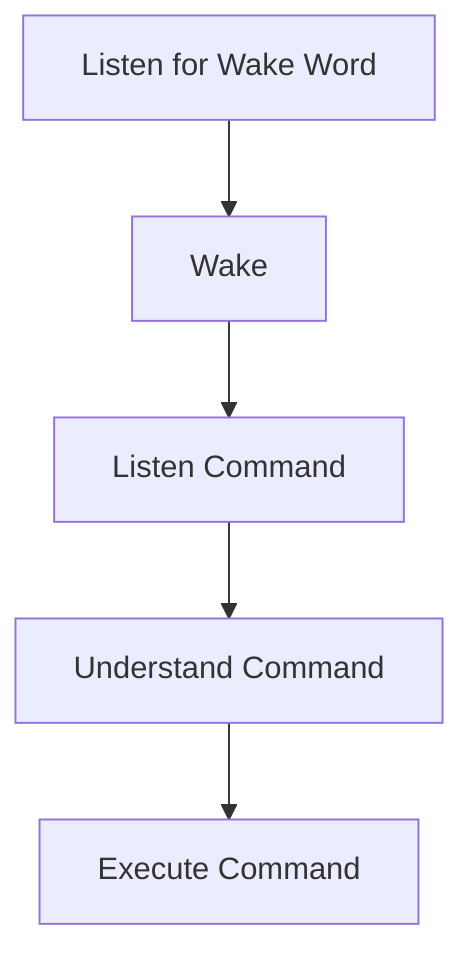

# MaltAI Project

## 1. Objective
Create a physical AI assistant. It should interact with users through speech, do basic tasks, and control hardware. First test on a computer, then move to something like a Raspberry Pi or ESP32.

## 2. Key Features
- **Speech Interaction**  
  - Voice Recognition: Understand user commands via speech.  
  - Text-to-Speech (TTS): Reply with synthesized voice.
- **Natural Language Processing (NLP)**  
  - Use AI models (e.g., GPT) to process user inputs.
- **Task Automation**  
  - Do simple tasks like reminders, music, or information lookup.
- **Hardware Integration (Future)**  
  - Control devices like LEDs, sensors, or motors.
- **Customizable Skills**  
  - Add modules for weather, home automation, or other APIs.

## 3. Logical Flow

## 4. Architecture (v.01 - Initial Prototype)

### Hardware Components
- Raspberry Pi or Arduino
- Microphone
- Camera
- Sensors (Future)
- Motors (Future)

### Software Components
- **Operating System**: Linux (e.g., Raspbian)
- **Speech Recognition Module**
- **Speech Synthesis Module**
- **Command Processing Engine**
- **Web-based UI**

### Communication
- Internal communication between modules
- External communication via Wi-Fi or Bluetooth

### Power Supply
- Battery or adapter

### Speech Engine
- Speech Recognition
- Speech Synthesis

### Web User Interface
- Flask (back end)
- HTML/CSS/JS (front end)

### Orchestration Engine
- Command Loop (handles input, processes tasks)

## 5. Hardware
- **USB Microphone**: Capture audio.
- **Raspberry Pi**: Main computing unit.
- **Speaker**: Output audio.
- **Future Components**: Motors, camera, more sensors.

## 6. Software
- **Operating System**: Linux (e.g., Raspbian)
- **Speech Recognition**: Google Speech-to-Text or CMU Sphinx
- **Speech Synthesis**: Google TTS or eSpeak
- **Command Processing**: Python (logic), Flask (web routes)
- **UI**: HTML/CSS/JS, optional Bootstrap

